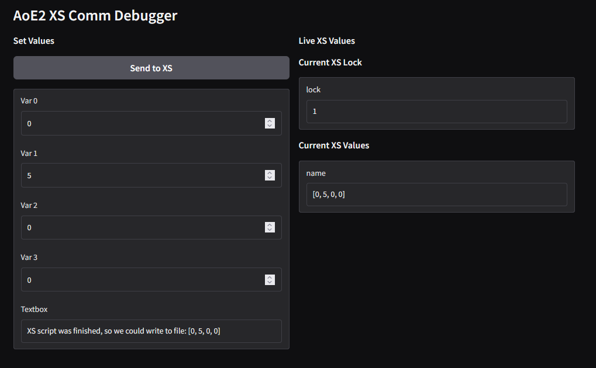
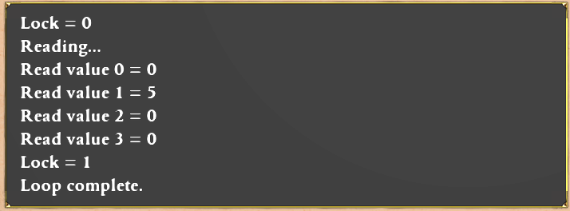

# aoe2-xs-comm
A framework to communicate between Age of Empires II's XS script and external Python code.

This project allows communication between Age of Empires II DE's XS scripting engine and a Python GUI. The GUI is accessible in a local web browser. Communication is achieved by setting trigger variables, which can be used by triggers in a scenario.


## Usage guide


### Installation

- Age of Empires II: Definitive Edition installed.
- Python 3.7 or higher installed.

Install prerequisites:

```bash
pip install gradio AoE2ScenarioParser
```

Create a scenario in the Scenario Editor according to your tastes and save it. Any scenario will do, really.


### Launching

#### Preparation
- Change the parameters in `config.py`, notably your Windows account name, ID and the name of the scenario you created.
- Run the `add_xs_and_trigger_to_scenario.py` file. This will modify the scenario with the specified name and create a new scenario with the same name but a "_MODIFIED" suffix.

#### Live
- Launch AoE II and launch the scenario with the "_MODIFIED" suffix (either testing in editor or in skirmish). This will create a xsdat file and wait for sync.
- Now, launch the `xs_comm_gui.py` Python script in a terminal (and do not close it), which will launch the Gradio GUI.


### Usage

- You can now connect to the GUI at 127.0.0.1:7860 (by default). Live XS values are displayed and update every second in the GUI
- Set values for trigger variables and click **Send to XS**. 



- In game, the values will be printed every in-game second in the chat.



## Development

The variables passed are trigger variables, but further trigger or xs modifications could be used to pass AI script variables, goals, etc. Currently, nothing is done with the variables. The goal of this repository is just to be a proof-of-concept showing that communication is possible and straightforward.

In addition, in `add_xs_and_trigger_to_scenario.py` and in `my_comm.xs`, I have marked places where game logic code could be added. It is of course also possible to use those Trigger Variables in AoE2 to drive scenario logic, with the caveats mentioned below.

Issues to watch out for:

- Ensure the definitions (number of variables, locks) are the same in `config.py` and in the first lines of `my_comm.xs`.

- By default, this will use the first trigger variables (IDs 0 to config.NUM_VARS-1), so be careful if you are using those in other triggers. There is a position in the code to add potentially another lock, so the game engine can signal it's done using them, but for now it's not implemented for simplicity and to reduce delays.
  - For now, it's best to use them in a read-only manner within the AoE2 engine, and modify them by modifying the XS script at the relevant places to collect information (the XS script can potentially be used to copy *other* Trigger Variables into the communicating variables before they are written, to pass information back from the engine).

- The existing triggers in your scenario will NOT be overwritten. The only compatibility risk, as mentioned above, is that this will reserve the use of the first config.NUM_VARS trigger variables.


## Contact and Informations

This work is made available under the MIT License.

Original link: https://github.com/qferre/aoe2-xs-comm

For questions, please contact <quentin.q.ferre@gmail.com>

Thanks to the [AoE2ScenarioParser](https://ksneijders.github.io/AoE2ScenarioParser/getting_started/) library, and the [UGC XS](https://ugc.aoe2.rocks/general/xs/programmer/) documentation, without which this project would not have been possible.